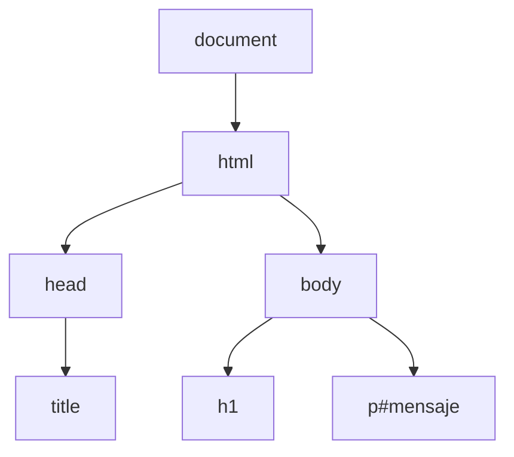

<style>
:global(:root) {
  --slidev-transition-duration: 0.2s;
}
.slidev-layout h1,
.slidev-layout h2 { color: #ffffff !important; }
.slide-two-cols.slidev-layout { padding-left: 1.5rem; padding-right: 1.5rem; }

/* Light mode: light slide background and readable text */
html:not(.dark) body,
html:not(.dark) .slidev-layout {
  background: #ffffff !important;
}
html:not(.dark) .slidev-layout {
  color: #333;
}
html:not(.dark) .slidev-layout h1,
html:not(.dark) .slidev-layout h2 { color: #1a1a1a !important; }
html:not(.dark) .slidev-layout .text-white { color: #1a1a1a !important; }

/* Light mode: preview/code boxes – light background instead of dark grey */
html:not(.dark) .slidev-layout .bg-\[\#1e1e1e\],
html:not(.dark) .slidev-layout [class*="1e1e1e"] {
  background-color: #f4f4f5 !important;
  color: #1a1a1a !important;
  border-color: #e5e7eb !important;
}
html:not(.dark) .slidev-layout .bg-\[\#2d2d2d\],
html:not(.dark) .slidev-layout [class*="2d2d2d"] {
  background-color: #e5e7eb !important;
  color: #1a1a1a !important;
}
html:not(.dark) .slidev-layout [class*="border-white"] {
  border-color: #e5e7eb !important;
}
html:not(.dark) .slidev-layout .bg-white\/10 { background-color: rgba(0,0,0,0.06) !important; }
html:not(.dark) .slidev-layout .bg-white\/20 { background-color: rgba(0,0,0,0.1) !important; }
html:not(.dark) .slidev-layout .demo-classlist .hecha { color: #6b7280; }
</style>

# Webs dinámicas con JavaScript

## AWEB - SMR1

<!--
En esta presentación repasamos los conceptos de JavaScript necesarios para hacer una página web dinámica: incluir scripts, acceder al DOM, responder a eventos y crear elementos. Todo orientado a la actividad de la lista de tareas.
-->

---
layout: default
transition: slide-left
---

# Estructura de la presentación

<div class="grid grid-cols-1 gap-4 text-xl">

1. Introducción: HTML, CSS y JavaScript
2. JavaScript en HTML
3. Variables y tipos básicos
4. Acceso al DOM
5. Eventos: addEventListener
6. Creación de nodos
7. Formularios
8. Atributos y clases
9. Validaciones
10. Recursos

</div>

<!--
Seguimos el guión de la guía de JavaScript. Cada concepto tiene ejemplos ejecutables en la carpeta ejemplos/ que se pueden abrir en el navegador.
-->

---
layout: section
class: text-center
---

# INTRODUCCIÓN

## HTML, CSS y JavaScript

---
layout: default
---

# ¿Por qué JavaScript?

<div class="grid grid-cols-1 gap-6 text-xl">

- **HTML** define la **estructura** de la página.
- **CSS** define el **aspecto** (colores, fuentes, diseño).
- Para que la página **reaccione** al usuario y **cambie** sin recargar hace falta **JavaScript**.

</div>

<div class="mt-8 px-6 py-4 rounded-lg bg-[#2d2d2d] text-white">
  <div class="font-bold mb-2">JavaScript en el navegador permite:</div>
  <ul class="list-disc pl-6 space-y-1">
    <li>Leer y modificar el contenido de la página</li>
    <li>Responder a <strong>eventos</strong> (clic, tecla, envío de formulario)</li>
    <li>Crear y eliminar elementos dinámicamente</li>
  </ul>
</div>

<!--
JavaScript se ejecuta en el navegador y cierra el trío HTML-CSS-JS: estructura, presentación y comportamiento. Sin JS la página es estática.
-->

---
layout: default
---

# Cómo usar los ejemplos

<div class="overflow-x-auto">

| Carpeta | Concepto |
|---------|----------|
| `01-incluir-script` | Incluir JavaScript en la página |
| `02-acceso-dom` | Variables, getElementById, textContent |
| `03-captura-eventos` | addEventListener('click', ...) |
| `04-crea-eliminar` | createElement, appendChild, removeChild |
| `05-envio-formulario` | Evitar recarga al enviar un form |
| `06-cambiar-clases` | Añadir/quitar/toggle clases CSS |

</div>

<div class="mt-6">

Abre el **index.html** de cada carpeta en el navegador y el **script.js** en el editor para probar cada concepto.

</div>

<!--
Esta tabla sirve de guía rápida: cada fila es un ejemplo ejecutable que ilustra un concepto. Recomendar seguir el orden para construir mentalmente la lista de tareas.
-->

---
layout: section
class: text-center
---

# 1. JAVASCRIPT EN HTML

---
layout: default
class: slide-two-cols
---

# Cómo incluir JavaScript en HTML

<div class="text-white">Para ejecutar JavaScript en una página, se <strong>enlaza</strong> un archivo <code>.js</code> con la etiqueta <code>&lt;script&gt;</code>:</div>

```html
<script src="script.js"></script>
```

<div class="mt-2 text-lg">Suele colocarse <strong>al final del <code>&lt;body&gt;</code></strong> para que el DOM esté cargado cuando se ejecute el script.</div>

<div class="grid grid-cols-2 gap-6 mt-4">
  <div class="min-w-0 pr-2">
    <div class="text-xs mb-1"><strong>Código fuente HTML</strong></div>

```html
<!DOCTYPE html>
<html lang="es">
<head> ... </head>
<body>
  <h1>Título</h1>
  <p id="mensaje">El script cambiará este mensaje</p>
  <script src="script.js"></script>
</body>
</html>
```

  </div>
  <div class="min-w-0">
    <div class="text-xs mb-1"><strong>Vista previa</strong></div>
    <div class="border border-white/30 rounded-lg p-4 bg-[#1e1e1e]">
      <h1 class="text-xl font-bold m-0">Título</h1>
      <p class="m-0 text-sm opacity-90">El script cambiará este mensaje</p>
    </div>
  </div>
</div>

<div class="absolute bottom-6 left-12 right-12 text-sm opacity-90"><strong>Ejemplo completo:</strong> <code>01-incluir-script</code></div>

<!--
Si ponemos el script en el head, el DOM aún no existe cuando se ejecuta. Al final del body garantizamos que los elementos ya están en la página.
-->

---
layout: section
class: text-center
---

# 2. VARIABLES Y TIPOS BÁSICOS

---
layout: default
---

# Uso básico de variables

<div class="mt-4 px-6 py-1 rounded-lg bg-[#2d2d2d] text-white">

En JavaScript las variables se declaran con `var` o `const`; no hace falta especificar el tipo (cadena, número, booleano, etc.): el lenguaje lo infiere del valor asignado.

</div>

<div class="mt-4"></div>

```javascript
const nombre = 'Lista de tareas';                   // string
var cantidad = 3;                                   // número
const activa = true;                                // booleano
const tareas = ['Comprar pan', 'Hacer ejercicio'];  // array

cantidad = cantidad + 1;                            // var permite cambiar el valor
if (activa) {
  const mensaje = `${nombre}: ${cantidad} tareas`;
  console.log(mensaje);
  console.log('Tarea actual:', tareas[1]);
}
```

<div v-click class="mt-4 p-4 rounded-lg bg-[#1e1e1e] border border-white/20">
  <div class="text-sm opacity-80 mb-2">Output (consola):</div>
  <pre class="m-0 text-sm text-green-400 font-mono">Lista de tareas: 4 tareas
Tarea actual: Hacer ejercicio</pre>
</div>

<!--
En la lista de tareas usaremos sobre todo const para referencias a elementos (botones, lista, formulario) y strings para el texto de cada tarea.
-->

---
layout: default
---

```javascript
const menu = { 1: 'Añadir', 2: 'Buscar', 3: 'Listar', 4: 'Salir' };
const contactos = [
  { nombre: 'Ana', telefono: '612 000 001' },
  { nombre: 'Luis', telefono: '623 111 002' }
];

function mostrarMenu() {
  Object.entries(menu).forEach(([n, t]) => console.log(`${n}. ${t}`));
}

mostrarMenu();
console.log('Opción 3 →');
contactos.forEach(c => console.log(`  ${c.nombre}: ${c.telefono}`));
```

<div v-click class="mt-4 p-4 rounded-lg bg-[#1e1e1e] border border-white/20">
  <div class="text-sm opacity-80 mb-2">Output (consola):</div>
<pre class="m-0 text-sm text-green-400 font-mono">1. Añadir  
2. Buscar  
3. Listar  
4. Salir
Opción 3 →
  Ana: 612 000 001
  Luis: 623 111 002</pre>
</div>

<!--
Objetos (menú, contactos), función mostrarMenu, Object.entries/forEach; simula opción 3 (listar).
-->

---
layout: section
class: text-center
---

# 3. ACCESO AL DOM

---
layout: two-cols
---

# ¿Qué es el DOM?

<div class="text-white">El <strong>DOM</strong> (Document Object Model) es un árbol de nodos que corresponde a cada etiqueta HTML.</div>

<div class="mt-4">

```html
<!DOCTYPE html>
<html lang="es">
<head>
  <title>Mi página</title>
</head>
<body>
  <h1>Título</h1>
  <p id="mensaje">El script cambiará este mensaje</p>

  <script src="script.js"></script>
</body>
</html>
```

</div>

::right::

<div class="text-sm">



</div>

<!--
El DOM es la API que permite a JavaScript "ver" y modificar la página. El diagrama muestra cómo un HTML con head (title) y body (h1, p) se convierte en un árbol de nodos.
-->

---
layout: default
---

# Ejemplo de acceso al DOM

<div class="text-sm">

- **Acceso por id:** `getElementById('mensaje')` obtiene la referencia al elemento del DOM cuyo `id` es `mensaje`.
- **Acceso por etiqueta:** `querySelector('h1')` busca el **primer** elemento `<h1>` del documento y devuelve su referencia.
- **Acceso a contenidos:** `textContent` permite **leer** el texto visible del nodo o **asignar** un nuevo texto.

</div>

```javascript
const mensaje = document.getElementById('mensaje');
mensaje.textContent = 'Texto nuevo desde JavaScript';

const titulo = document.querySelector('h1');
titulo.textContent = 'Nuevo título';
```

<table class="text-sm w-full">
  <thead>
    <tr>
      <th class="py-2">Antes de enlazar script</th>
      <th class="py-2">Después de enlazar script</th>
    </tr>
  </thead>
  <tbody>
    <tr>
      <td class="align-top pr-4" style="width: 55%;">
        <div class="border border-white/30 rounded-lg p-4 bg-[#1e1e1e]">
          <h1 class="text-xl font-bold">Título</h1>
          <p id="mensaje" class="m-0 text-sm opacity-90">El script cambiará este mensaje</p>
        </div>
      </td>
      <td class="align-top" style="width: 45%;">
        <div class="border border-white/30 rounded-lg p-4 bg-[#1e1e1e]">
          <h1 class="text-xl font-bold">Nuevo título</h1>
          <p id="mensaje" class="m-0 text-sm opacity-90">Texto nuevo desde JavaScript</p>
        </div>
      </td>
    </tr>
  </tbody>
</table>

<div class="absolute bottom-6 left-12 right-12 text-sm opacity-90"><strong>Ejemplo completo:</strong> <code>02-acceso-dom</code></div>

<!--
El **DOM es la representación viva del documento**; cualquier cambio en los nodos se refleja en pantalla.
-->

---
layout: section
class: text-center
---

# 4. EVENTOS

---
layout: default
---

# Escuchar eventos

<div class="text-white">
Usamos <code>addEventListener</code> sobre un elemento del DOM con dos argumentos: el <strong>tipo de evento</strong> y una <strong>función</strong>. Cuando ese evento ocurre en el elemento, el navegador ejecuta la función.
</div>

**Tipos de eventos comunes:**
- `click`: se dispara cuando el usuario hace clic sobre el elemento (botón, enlace, etc.). 
- `submit`: se dispara cuando se envía un formulario, por ejemplo al pulsar el botón «Enviar» o pulsar Enter.

<div class="mb-4"></div>

```javascript
const boton = document.getElementById('boton');
const mensaje = document.getElementById('mensaje');

boton.addEventListener('click', function () {
  mensaje.textContent = '¡Has pulsado el botón!';
});
```

Obtiene los elementos botón y párrafo mediante su `id`; configura el botón para que al hacer clic, se ejecuta la función y se actualiza el texto del párrafo.

<!--
addEventListener permite separar estructura (HTML) y comportamiento (JS): no hace falta poner onclick en el HTML. Mejor mantener todo el comportamiento en el script.
-->

---
layout: default
---

# Ejemplo de escucha de eventos

```html
<!DOCTYPE html>
<body>
  <h1>Eventos</h1>
  <p id="mensaje">El script cambiará este mensaje</p>
  <button id="boton">Pulsar</button>
  <script src="script.js"></script>
</body>
</html>
```

<table class="text-sm w-full">
  <thead>
    <tr>
      <th class="py-2">Antes de pulsar el botón</th>
      <th class="py-2">Después de pulsar el botón</th>
    </tr>
  </thead>
  <tbody>
    <tr>
      <td class="align-top pr-4" style="width: 55%;">
        <div class="border border-white/30 rounded-lg p-4 bg-[#1e1e1e]">
          <h1 class="text-xl font-bold">Eventos</h1>
          <p id="mensaje" class="m-0 text-sm opacity-90 mb-3">El script cambiará este mensaje</p>
          <button type="button" class="px-3 py-1.5 rounded bg-white/20 text-sm border border-white/40">Pulsar</button>
        </div>
      </td>
      <td class="align-top" style="width: 45%;">
        <div class="border border-white/30 rounded-lg p-4 bg-[#1e1e1e]">
          <h1 class="text-xl font-bold">Eventos</h1>
          <p id="mensaje" class="m-0 text-sm opacity-90 mb-3">¡Has pulsado el botón!</p>
          <button type="button" class="px-3 py-1.5 rounded bg-white/20 text-sm border border-white/40">Pulsar</button>
        </div>
      </td>
    </tr>
  </tbody>
</table>

<div class="absolute bottom-6 left-12 right-12 text-sm opacity-90"><strong>Ejemplo completo:</strong> <code>03-captura-eventos</code></div>

---
layout: section
class: text-center
---

# 5. CREACIÓN DE NODOS

---
layout: default
---

# Crear y añadir nodos

<div class="text-sm">

- **Crear:** `document.createElement('li')` crea un nodo nuevo de tipo "elemento de lista" (`<li>`). El nodo aún no está visible en la página hasta que se añade a un elemento que ya esté en el DOM.
- **Añadir hijo:** `lista.appendChild(li)` inserta `li` como último hijo de `lista`.
- **Quitar hijo:** `lista.removeChild(li)` elimina `li` de los hijos de `lista`.

</div>

```javascript
const botonAnadir = document.getElementById('anadir');
const botonEliminar = document.getElementById('eliminar');
const lista = document.getElementById('listaTareas');

botonAnadir.addEventListener('click', function () {
  const li = document.createElement('li');
  li.textContent = 'Nueva tarea';
  lista.appendChild(li);
});
botonEliminar.addEventListener('click', function () {
  const ultimo = lista.lastElementChild;
  if (ultimo) lista.removeChild(ultimo);
});
```

El botón «Añadir» crea un `<li>` y lo añade a la lista. El botón «Eliminar» quita el último `<li>` de la lista.

<!--
La lista se construye dinámicamente: cada vez que el usuario añade una tarea, creamos un nuevo li y lo colgamos del ul.
-->

---
layout: default
class: slide-two-cols
---

# Ejemplo de creación de nodos

<div class="grid grid-cols-2 gap-6 mt-4">
  <div class="min-w-0 pr-2">
    <div class="text-xs mb-1"><strong>Código fuente HTML</strong></div>

```html
<!DOCTYPE html>
<html lang="es">
<head>
  <title>Mi página</title>
</head>
<body>
  <h1>Crear y eliminar</h1>
  <p id="mensaje">Pulsa para añadir o eliminar:</p>
  <ul id="listaTareas"></ul>
  <button id="anadir">Añadir</button>
  <button id="eliminar">Eliminar</button>
  <script src="script.js"></script>
</body>
</html>
```

  </div>
  <div class="min-w-0">
    <div class="text-xs mb-1"><strong>Vista previa</strong> (tras pulsar «Añadir» 4 veces y «Eliminar» 1 vez)</div>
    <div class="border border-white/30 rounded-lg p-4 bg-[#1e1e1e] text-left">
      <h1 class="text-xl font-bold m-0 mb-2">Crear y eliminar</h1>
      <div class="text-xs opacity-80 mb-2 m-0">Pulsa para añadir o eliminar:</div>
      <ul class="list-disc pl-5 m-0 text-sm mb-2">
        <li>Nueva tarea</li>
        <li>Nueva tarea</li>
        <li>Nueva tarea</li>
      </ul>
      <div class="flex gap-2">
        <button type="button" class="px-3 py-1.5 rounded bg-white/20 text-sm border border-white/40">Añadir</button>
        <button type="button" class="px-3 py-1.5 rounded bg-white/20 text-sm border border-white/40">Eliminar</button>
      </div>
    </div>
  </div>
</div>

<div class="absolute bottom-6 left-12 right-12 text-sm opacity-90"><strong>Ejemplo completo:</strong> <code>04-crea-eliminar</code></div>

<!--
Cada clic en el botón ejecuta el callback: se crea un nuevo li y se añade a la lista, así que en la página aparece un elemento más.
-->

---
layout: section
class: text-center
---

# 6. FORMULARIOS

---
layout: default
---

# Envío de formularios

<div class="text-sm">

- **Evento submit:** Al enviar un `<form>` (Enter o botón «Enviar») el navegador dispara `submit` y **recarga la página** por defecto.
- **Evitar recarga:** `evento.preventDefault()` cancela la recarga; así podemos añadir nodos `<li>` a la lista.
- **Valor del input:** En nodos `<input>` se usa `elemento.value` para leer o escribir el texto del usuario.

</div>

```javascript
const form = document.getElementById('formTarea');
const inputTarea = document.getElementById('textoTarea');
const lista = document.getElementById('listaTareas');

form.addEventListener('submit', function (evento) {
  evento.preventDefault();
  const texto = inputTarea.value;
  const li = document.createElement('li');
  li.textContent = texto;
  lista.appendChild(li);
  inputTarea.value = '';
});
```

Al enviar el formulario (Enter o botón), se ejecuta la función. `e.preventDefault()` evita que la página se recargue. Se lee el valor del input con `.value` y se crea un `<li>` con ese texto, se añade a la lista y se vacía `inputTarea` para la siguiente tarea.

---
layout: default
class: slide-two-cols
---

# Ejemplo envío de formulario

<div class="grid grid-cols-2 gap-6 mt-4">
  <div class="min-w-0 pr-2">
    <div class="text-xs mb-1"><strong>Código fuente HTML</strong></div>

```html
<!DOCTYPE html>
<html lang="es">
<head>
  <title>Mi página</title>
</head>
<body>
  <h1>Formularios</h1>
  <p id="mensaje">Añade y elimina tareas:</p>
  <ul id="listaTareas"></ul>
  <form id="formTarea">
    <input type="text" id="textoTarea" placeholder="Nueva tarea">
    <button type="submit">Añadir</button>
  </form>
  <button id="eliminar">Eliminar última</button>
  <script src="script.js"></script>
</body>
</html>
```

  </div>
  <div class="min-w-0">
    <div class="text-xs mb-1"><strong>Vista previa</strong> (lista con 2 tareas añadidas)</div>
    <div class="border border-white/30 rounded-lg p-4 bg-[#1e1e1e] text-left">
      <h1 class="text-xl font-bold m-0 mb-2">Formularios</h1>
      <div class="text-xs opacity-80 mb-2 m-0">Añade y elimina tareas:</div>
      <ul class="list-disc pl-5 m-0 text-sm mb-2">
        <li>Comprar pan</li>
        <li>Hacer ejercicios</li>
      </ul>
      <form class="flex gap-2 mb-2">
        <input type="text" placeholder="Nueva tarea" class="flex-1 px-2 py-1.5 rounded bg-white/10 border border-white/30 text-sm">
        <button type="submit" class="px-3 py-1.5 rounded bg-white/20 text-sm border border-white/40">Añadir</button>
      </form>
      <button type="button" class="px-3 py-1.5 rounded bg-white/20 text-sm border border-white/40">Eliminar última</button>
    </div>
  </div>
</div>

<div class="absolute bottom-6 left-12 right-12 text-sm opacity-90"><strong>Ejemplo completo:</strong> <code>05-envio-formulario</code></div>

<!--
Misma página que la lista de tareas: ahora el usuario escribe el texto en un input y al enviar el form se añade un li con ese texto. preventDefault evita que la página se recargue al pulsar Enter o el botón.
-->

---
layout: section
class: text-center
---

# 7. ATRIBUTOS Y CLASES

---
layout: default
---

# Añadir, quitar y alternar clases

<div class="text-sm">

- **Añadir clase:** `li.classList.add('hecha')` añade la clase `hecha` a `li`. Si ya la tiene, no hace nada.
- **Quitar clase:** `li.classList.remove('hecha')` quita la clase `hecha` de `li`, que vuelve a su aspecto normal.
- **Alternar:** `li.classList.toggle('hecha')` — si `li` tiene la clase la quita; si no la tiene la añade. En el script se usa esta para marcar/desmarcar la tarea al hacer clic (estado hecho/no hecho).

</div>

```javascript
lista.addEventListener('click', function (evento) {
  const li = evento.target.closest('li');
  if (li) li.classList.toggle('hecha');
});
```


Se escucha el evento `click` en la lista. Cuando el usuario hace clic, se comprueba si el elemento clicado es un `<li>` con `evento.target.closest('li')`. Si es así, se llama a `li.classList.toggle('hecha')`: se añade la clase si no la tiene o se quita si ya la tiene. El CSS define el aspecto de `.hecha` (texto tachado), así que el ítem cambia de aspecto al hacer clic.


<!--
toggle es muy cómodo para estados binarios: hecho/no hecho, abierto/cerrado. Una sola llamada cambia el estado.
-->

---
layout: default
class: slide-two-cols
---

# Ejemplo cambio de clases

<div class="grid grid-cols-2 gap-6 mt-4">
  <div class="min-w-0 pr-2">
    <div class="text-xs mb-1"><strong>Código fuente HTML</strong></div>

```html

<!DOCTYPE html>
<html lang="es">
<head>
  <title>Mi página</title>
</head>
<body>
  <h1>Clases</h1>
  <p id="mensaje">Cambia clase de las tareas:</p>
  <ul id="listaTareas">
    <li>Comprar pan</li>
    <li>Hacer ejercicios</li>
  </ul>
  <script src="script.js"></script>
</body>
</html>
```

<div class="text-xs mb-1 mt-2"><strong>Clase CSS</strong></div>

```css
.hecha { text-decoration: line-through; opacity: 0.7; }
```

  </div>
  <div class="min-w-0">
    <div class="text-xs mb-1"><strong>Vista previa</strong> (tras hacer clic en el primer elemento)</div>
    <div class="demo-classlist border border-white/30 rounded-lg p-4 bg-[#1e1e1e] text-left">
      <h1 class="text-xl font-bold m-0 mb-2">Clases</h1>
      <div class="text-xs opacity-80 mb-2 m-0">Cambia clase de las tareas:</div>
      <ul class="list-disc pl-5 m-0 text-sm space-y-1">
        <li class="m-0 cursor-pointer select-none line-through opacity-70">Comprar pan</li>
        <li class="m-0 cursor-pointer select-none">Hacer ejercicios</li>
      </ul>
    </div>
  </div>
</div>

<div class="absolute bottom-6 left-12 right-12 text-sm opacity-90"><strong>Ejemplo completo:</strong> <code>06-cambiar-clases</code></div>

<!--
La vista previa es interactiva: el usuario puede hacer clic en cada li y ver cómo se añade/quita la clase hecha (tachado y opacidad). Usamos @click de Vue para simular el script.
-->

---
layout: section
class: text-center
---

# 8. VALIDACIONES

---
layout: default
---

# Validación de entrada

<div class="text-sm">

- **Validar entrada:** Antes de añadir una tarea conviene comprobar que el texto no esté vacío (o solo espacios), para no llenar la lista de líneas en blanco.
- **trim:** `cadena.trim()` devuelve una copia de la cadena sin espacios al inicio ni al final; así `"   "` se considera vacío.
- **Salir pronto:** Si la validación falla, hacemos `return` y no ejecutamos el resto de la función (no creamos `<li>` ni vaciamos el input).

</div>

```javascript
const form = document.getElementById('formTarea');
const inputTarea = document.getElementById('textoTarea');

form.addEventListener('submit', function (evento) {
  evento.preventDefault();

  const texto = inputTarea.value.trim();  // Quita espacios al principio y al final
  if (!texto) return;                     // Si texto está vacío terminamos la ejecución

  ...
});
```

Solo si `texto` tiene contenido después de `trim()` se crea el `<li>` y se añade a la lista; si está vacío, la función termina sin hacer nada. Se puede combinar con el manejador de `submit` del formulario.

<!--
Validar la entrada evita listas llenas de líneas vacías o solo espacios. trim() es esencial para strings que vienen de inputs de usuario.
-->

---
layout: section
class: text-center
---

# RECURSOS

---
layout: default
---

# Recursos externos

<div class="text-left text-lg space-y-2">

- **JavaScript:** [developer.mozilla.org/es/docs/Web/JavaScript](https://developer.mozilla.org/es/docs/Web/JavaScript)
- **DOM:** [developer.mozilla.org/es/docs/Web/API/Document_Object_Model](https://developer.mozilla.org/es/docs/Web/API/Document_Object_Model)
- **addEventListener:** [developer.mozilla.org/es/docs/Web/API/EventTarget/addEventListener](https://developer.mozilla.org/es/docs/Web/API/EventTarget/addEventListener)
- **createElement:** [developer.mozilla.org/es/docs/Web/API/Document/createElement](https://developer.mozilla.org/es/docs/Web/API/Document/createElement)
- **HTML:** [developer.mozilla.org/es/docs/Web/HTML](https://developer.mozilla.org/es/docs/Web/HTML)
- **CSS:** [developer.mozilla.org/es/docs/Web/CSS](https://developer.mozilla.org/es/docs/Web/CSS)

</div>

<!--
MDN es la referencia más fiable para web. Toda la documentación está disponible en español.
-->
